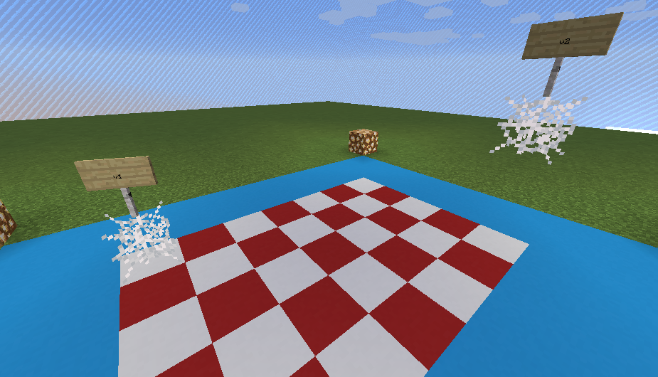

# mineflayer-place

This plugin lets your bot know when an entity enter or leave a place.

## Code

Load plugin:
```js
const Vec3 = require('vec3');
const mineflayer = require('mineflayer');
const placePlugin = require('mineflayer-place');

const bot = mineflayer.createBot({
  username: 'Bot'
});

placePlugin(bot);
```

Handle events:
```js
bot.place.on('enter', (entity, placename, place) => {
  console.log(entity.type);
  console.log("enter: " + entity.uuid);
});

bot.place.on('leave', (entity, placename, place) => {
  console.log(entity.type);
  console.log("leave: " + entity.uuid);
});
```

Register places
```js
// change this coordinates to your needs
v1 = new Vec3(5, 65, -3);
v2 = new Vec3(11, 67, 1);
// register
bot.place.register('near', v1, v2);
```


